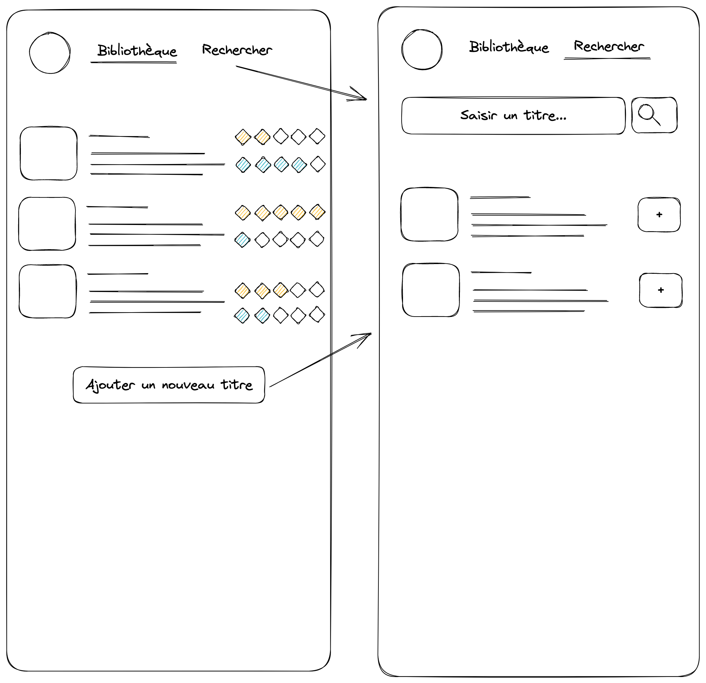

# Test technique spotify

### Fonctionalités de l'application

Les fonctionnalités de l'application seront les suivantes :
 - Pouvoir rechercher des titres de chanson sur Spotify
 - Ajouter les chansons recherchées à une bibliothèque 
 - Pouvoir noter les chansons selon 2 critères :
   - Une note indiquant notre goût (note jaune sur les maquettes) 
     - *1/5 => "la musique ne me plait pas "* 🙁
     - *5/5 => "C'est la meilleure musique que j'ai jamais écoutée !"* 😍
   - Une note d'originalité (note bleue sur les maquettes)  
     - 1/5 => "J'ai déjà entendue cette musique 1000 fois !" 😴
     - 5/5 => "Qu'est-ce que c'est que cette dinguerie ?" 🤘

L'application est composée de 2 pages :
- la première liste tous les titres de notre bibliothèque, et permet de les noter. Les titres sont ordonnés par la moyenne des deux critères. 
- la deuxième page permet de rechercher des titres sur Spotify, et de les ajouter à notre bibliothèque.

### Démarrage du projet (application dotnet core 7)

Côté backend, on utilisera comme base, le code de ce repository qui contient une application dotnet core, Entity Framework et une base de donnée vierge SQLite.

Pour l'UI, on utilisera TailwindCSS (inclu dans le template).

Pour lancer le projet, on rentre dans le répertoire `./TestTechniqueSpotify` puis on exécute la commande `dotnet run` ou on ouvre le projet avec VSCode, puis on lance le projet depuis le menu `Debug`.

Pour compiler le front, on utilisera: `npm run watch ou npm run build`

### Consignes

- Implémenter une version des 2 écrans à l'image des maquettes proposées ci-dessus
- L'implémentation doit tenir compte des fonctionnalités mentionées ci-dessus

**Remarques :**
- Il est possible d'utiliser toutes les nouvelles features de C#/dotnet, d'installer des plugins aussi bien front que back.  
Soyez créatif.
- Pensez à commiter vos modifications au fur et à mesure de votre avancement. Si vous n'arrivez pas au bout du test, pas de panique, cela nous permettra de voir votre cheminement et la manière dont vous avez approché le développement.  
